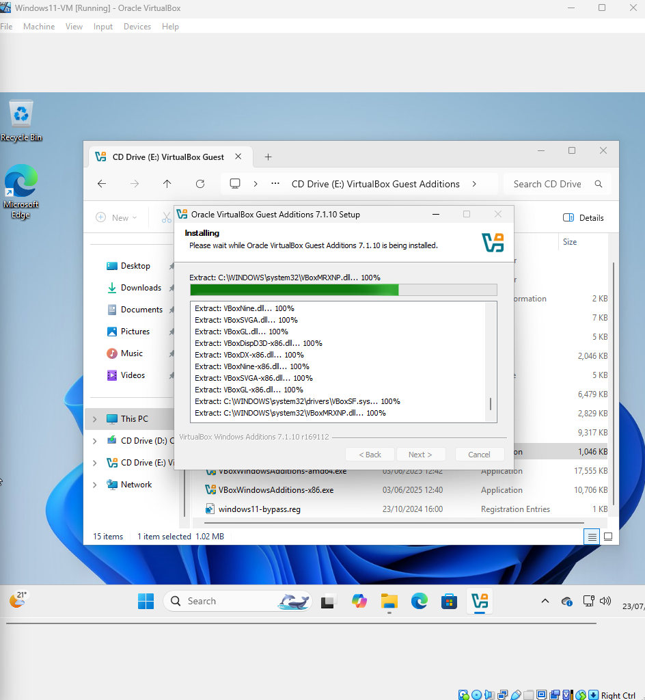

# 🪟 Windows VM Setup in VirtualBox

This project documents the step-by-step process I followed to install and configure a **Windows virtual machine** using **Oracle VirtualBox**. It includes screenshots, detailed steps, and troubleshooting notes based on real setup issues I encountered and resolved.

---

## Project Goals

- Install and run Windows 11 in a VirtualBox VM
- Gain hands-on experience with virtualization
- Understand hardware virtualization settings, boot sequences, and ISO handling
- Create a reusable reference for future VM setups

---

## Structure

| Folder/File         | Purpose                                                 |
|---------------------|---------------------------------------------------------|
| `steps/`            | Step-by-step breakdown of the entire setup process      |
| `images/`           | Screenshots captured during the VM setup                |
| `NOTES.md`          | Troubleshooting notes, lessons learned, and summary     |
| `README.md`         | This file                                               |

---

## Setup Process

You'll find all the stages of the setup inside the `steps/` folder. Key stages include:

1. Downloading Windows ISO  
2. Creating a new VM  
3. Mounting ISO & configuring VM settings  
4. Boot order setup  
5. Installing Guest Additions  
6. Final tuning & testing

Each file in the `steps/` folder is self-contained with images and clear instructions.

---

## Common Issues

Check out `NOTES.md` for real-world troubleshooting, including:

- ISO not detected during boot  
- Boot order misconfiguration  
- TPM and EFI settings for Windows 11  
- Live CD/DVD checkbox importance  
- Performance tips (CPU, VT-x, etc.)

---

## Reflection

Setting up this VM took longer than expected, I hit a few snags with ISO mounting and startup failures. These issues forced me to dive deeper into VirtualBox’s settings (like Live CD, controller types, and boot priority), which in the end helped me build a much clearer understanding of virtual machine configuration. Now I feel much more confident spinning up VMs quickly and effectively.

---

## 📸 Sample Screenshot

**Guest Additions Installed:**  

---

## ✅ Requirements

- Oracle VirtualBox  
- Windows ISO (Win 10 or 11)  
- CPU with virtualization support (VT-x / AMD-V)

---

