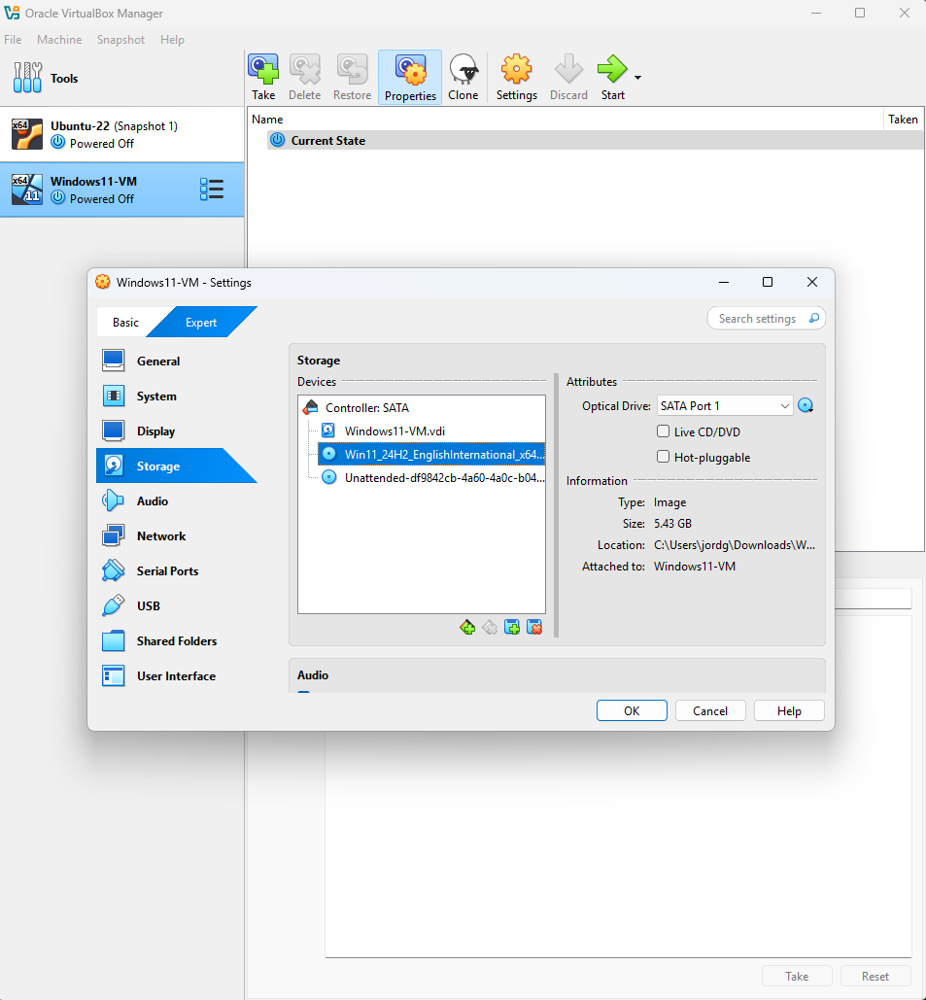

### Step 2: Configure Virtual Storage

1. Choose **Create a virtual hard disk now** when prompted.
2. Select **VDI (VirtualBox Disk Image)** as the disk type.
3. Choose **Dynamically allocated** for flexible storage usage.
4. Set disk size to at least **32 GB** (64 GB or more recommended for long-term use).

📸 **Screenshot of hard disk format and allocation type:**  

📸 **Screenshot of virtual hard disk size selection:**  

---

### Step 3: Mount Windows ISO in Virtual Storage

1. Go to the VM's settings and click on the **Storage** tab.
2. Mount the Windows ISO under the IDE controller.

📸 **Screenshot showing ISO mounted to virtual disk:**  

