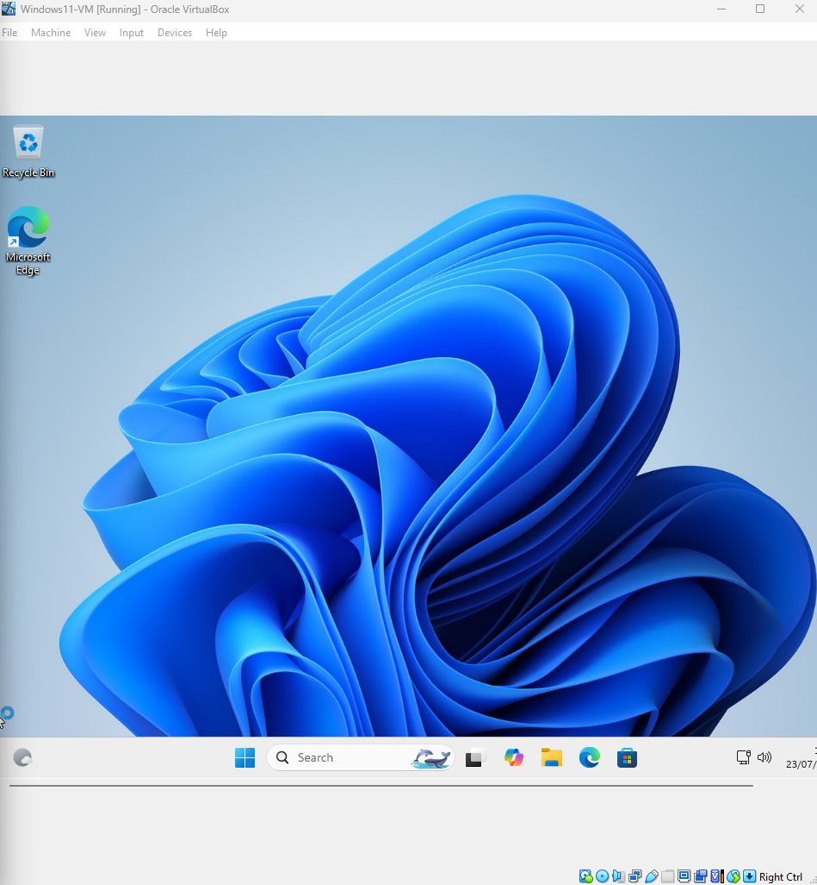

# 03 – Install Windows in VirtualBox

### Step 3: Begin Installation

1. Start the virtual machine.
2. Follow the installation prompts (language, region, etc.).
3. Choose **Custom Installation**.
4. If needed, delete existing partitions (all of them) and create new space for installation.

---

### Step 4: Complete Setup

1. Let Windows install and reboot automatically.
2. Continue setup until you reach the Windows desktop.

📸 **Screenshot of Windows 11 desktop after successful installation:**  

