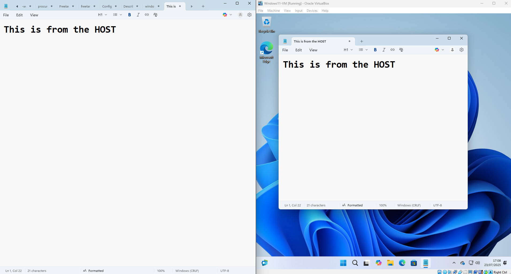
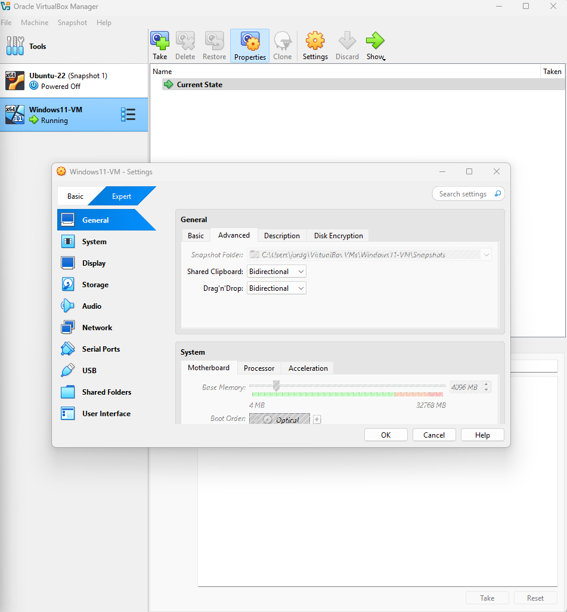

### Step 5: Verify Clipboard Sharing & Guest Additions

1. Enable **Shared Clipboard → Bidirectional** from the Devices menu.
2. Optionally enable **Drag and Drop → Bidirectional**.
3. Test clipboard sharing between host and guest by copying text both ways.
4. (Optional) Test drag and drop of files between host and guest.

📸 **Screenshot showing clipboard sharing settings enabled:**  

📸 **Screenshot showing bidirectional clipboard and drag & drop enabled in Devices menu:**  

📸 **Screenshots illustrating clipboard sharing in action:**  
- Split-screen showing copied text from host to VM (`clipboard-test-host-to-vm.png`)  
- Split-screen showing copied text from VM to host (`clipboard-test-vm-to-host.png`)  
- Drag and drop test showing file transferred (`drag-and-drop-test.png`)
